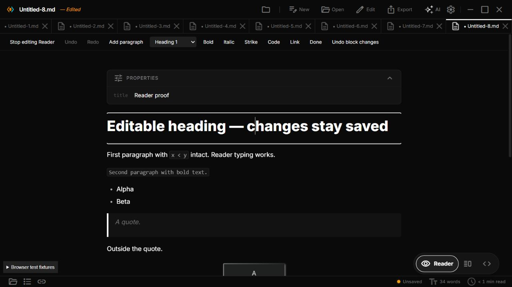

| Severity | Finding | Verification | Fix effort |
|---|---|---|---|
| P0 | Heading typing can disappear from the note | Reproduced with End + typing, and End + Enter + typing; inspected live DOM and then Code | Small containment fix, medium proper heading editing |
| P1 | Editing cannot move naturally between blocks | Double-clicking a second paragraph leaves the first editable | Medium |
| P1 | Undo fails after Done | Ctrl+Z on the completed paragraph did not undo; Reader Undo disappears | Medium |
| P2 | Ordinary inline code is wrongly rejected | A paragraph containing `x < y` is refused | Small to medium |
| P2 | Enter/block structure depends on browser HTML | Paragraph Enter creates a nested div; headings can create cloned buttons | Medium |

# Reader editing diagnosis — local browser inspection

The initial inspection on 2026-09-30 used `http://127.0.0.1:5279/?fakefs=1&raf=1&fixtures=1` and disposable virtual-disk notes through the app UI. That inspection made no code changes. The owner subsequently requested implementation; the READ-03 resolution below describes the follow-up. The finding locations below refer to the inspected version before that repair. Native WebView behavior was not tested.

The earlier verification covered simple paragraph typing and formatting. It did not establish reliable heading editing, cross-block navigation or undo after finishing. The current implementation is an isolated editable HTML block inside a rendered preview, and those missing flows expose real bugs.

## P0 — ordinary heading text can be lost

Locations: `src/components/MarkdownPreview.tsx:760`, `:781`, `:956`, `:926`.

```tsx
<span>{children}</span>
<button type="button" ...><span>link</span></button>
// The entire heading becomes contenteditable, including its copy button.
element.setAttribute("contenteditable", "true");
// Serialization then removes every button, including text typed inside one.
clone.querySelectorAll("button").forEach((button) => button.remove());
```

Reproduction:

1. Enter Reader with Edit Reader enabled. Double-click `# Reader diagnosis`.
2. Press End and type ` HEADING SUFFIX`.
3. The live DOM becomes `<button><span>link HEADING SUFFIX</span></button>` inside the editable heading.
4. Press Done. The suffix disappears. Switch to Code: the source is still `# Reader diagnosis`.
5. End, Enter, then typing also reproduced the loss; Enter cloned the copy-link button and the new text landed in that clone.

This is typed-text loss, not just visual roughness. The heading's decorative control inherits editability. The serializer intentionally discards controls, so this text never reaches the file session or recovery buffer.

Concrete fix: keep copy controls outside the editable text surface; explicitly make decorations non-editable and exclude them from selection/caret navigation. Preserve the heading's source role separately from its UI wrapper. Handle Enter with a source-aware transaction that creates a paragraph after the heading rather than accepting arbitrary browser child HTML. Verify End/Home, mouse caret placement, selections across the heading, Enter, Save and recovery before calling this safe.

Evidence screenshot: `C:/Users/Saqlain/.codex/visualizations/2026/09/30/01a0f234-d320-7cf3-85c2-37765c76b469/reader-heading-typing-loss.png`.

## P1 — moving to another paragraph gets stuck

Location: `src/components/MarkdownPreview.tsx:941`.

```ts
if (!readerEditing || !allowReaderEditing || !onContentChange || readerEditRef.current) return;
```

Reproduction: double-click the first paragraph, append text, then double-click the second paragraph. The second paragraph receives focus but stays read-only; the first paragraph remains the only `[contenteditable]` element. Users must press Done and then double-click again. Arrow movement, Backspace merging and creating adjacent blocks are also constrained by separate edit roots; only the double-click failure was directly reproduced here.

Concrete fix: preserve the current write-through, finish the previous block safely, and activate the requested block in the same interaction. Restore a caret at the actual clicked position. Add explicit cross-block arrow/Enter/Backspace navigation using document positions. A blur handler alone will not solve caret placement, structural changes or history.

## P1 — Done removes usable Reader undo

Locations: `src/components/MarkdownPreview.tsx:906`, `:1542`, `:1607`, `:1618`.

```ts
setReaderRevision((revision) => revision + 1);
// Revision is included in MarkdownBlock/wrapper keys, replacing the edited DOM.
// Undo/Redo buttons exist only while editingBlock is true.
document.execCommand(command);
```

Reproduction: edit `Final paragraph.` to `Final paragraph. UNSAVED`, press Done, focus that paragraph and press Ctrl+Z. The suffix remains. The Reader Undo button is no longer available. Undo during an active list edit did remove the newly typed text, so the failure is specifically history across finishing/re-rendering, not every undo operation.

Concrete fix: record Reader operations in a document/tab-scoped history with before/after source and selections. Undo should remain available after Done and across block switches; redo should preserve the same transactions. Keep tab identity and external-change guards. DOM remounting must not erase the only history available to the user. CodeMirror already receives source changes, but Reader keyboard commands do not route into that hidden editor's history.

## P2 — safe inline code receives a false rejection

Location: `src/utils/readerEdits.ts:21`.

```ts
if (/%%|<|...|\$|\^|.../mu.test(source)) return null;
```

Reproduction: double-click `Paragraph with \`x < y\` inline code.`. The app says to use Code for specialized Markdown. The `<` is literal text inside an inline-code span, but the guard treats it as unsafe HTML. The same broad checks can reject literal `$`/`^` in code or ordinary escaped punctuation; these additional examples are code findings, not separately reproduced browser cases.

Concrete fix: classify syntax from Markdown tokens/source ranges rather than raw whole-block punctuation. Protect actual HTML, extension and media nodes while allowing ordinary inline code and escaped text. Preserve each code span's content and delimiters through editing. Do not simply remove the guard: unsupported syntax still needs protection.

## P2 — Enter is delegated to browser-generated HTML

Locations: `src/components/MarkdownPreview.tsx:1584`, `src/utils/readerEdits.ts:25`.

```tsx
// Enter is handled only to START editing a focused block.
if (readerEditing && !readerEditRef.current && event.key === "Enter") { ... }
// During editing the browser chooses HTML structure; Turndown guesses Markdown.
const markdown = converter.turndown(html);
```

In a paragraph, Enter produced `<p>First paragraph<div>New paragraph after Enter.</div></p>` while editing. Done changed that into two proper rendered paragraphs. This causes a change of structure/layout when finishing. In a heading, the same lack of structural control produced the button cloning/text loss above. In an ordinary list, Enter correctly created a third `<li>` in this browser; that successful case should be preserved.

Concrete fix: define Enter and Shift+Enter behavior for paragraphs, headings, quotes and lists. Apply source-aware structural operations and preserve selection. Prevent illegal nested blocks and interactive UI from entering editable content. Validate the resulting source continuously, not just its surrounding substring.

## Code findings that may contribute to lag

Locations: `src/components/MarkdownPreview.tsx:925`, `:1172`, `:1190`, and `src/components/CodeEditor.tsx:882`.

Every input clones and serializes the entire selected block, writes a new whole-document string, reruns preview preprocessing, and synchronizes the hidden CodeMirror document. The expensive Markdown render is frozen while editing, but these other operations still occur. A long list is one editable block, so its entire HTML is converted per keystroke. This is a plausible large-note performance problem; no timing benchmark was performed, and it is not claimed as the cause of every observed interaction failure.

Concrete fix: keep editing state/selection in an editor model, apply source transactions by range, and freeze unnecessary preview preprocessing during active typing. Preserve synchronous recovery state while scheduling derived work. Profile real large notes before choosing debounce thresholds.

## What worked and should be retained

- Ordinary paragraph typing writes through to the Markdown source.
- Paragraph Enter persisted both text lines as separate paragraphs after Done.
- Ordinary list Enter created a new item, and in-block Undo removed its typed text.
- Surrounding paragraphs, quote and inline-code source survived the ordinary paragraph edit.
- Stale-range and tab-identity checks protect against overwriting unrelated content.
- The source-aware block boundaries and strict sanitization should remain.

## Gaps in the earlier tests

`src/components/MarkdownPreview.test.tsx:71` edits `innerHTML` directly and fires an input event. That establishes source replacement and a stable element for simple paragraphs; it does not exercise real caret placement, browser-generated Enter DOM, heading controls, native undo or moving between blocks. `src/utils/readerEdits.test.ts:21` tests inline-code conversion independently of the rejection guard, so it misses the `<` false positive. These tests were only read in this pass.

## Order of repair

1. Contain heading typed-text loss before further Reader editing work.
2. Fix switching blocks and preserve the clicked caret.
3. Add source-aware history across Done/block/tab changes and define structural key behavior.
4. Replace punctuation-based rejection with syntax-aware protection.
5. Profile conversion/preprocessing on large lists and notes; retain the working write-through/recovery guards.

## READ-03 — implemented follow-up

The owner requested easier editing after the inspection. The follow-up stays on `fix/github-issues-2026-09-30` and is committed locally. It is not pushed: pushing the PR branch would trigger GitHub Actions, which the owner explicitly excluded.

- `src/hooks/useReaderEditor.ts:56`: a source-addressed session activates text with one click, retains source ranges across block switches, and removes heading controls before any text can enter them. Input still writes through to the file session and recovery buffer.
- `src/hooks/useReaderEditor.ts:185`: bounded, per-tab history stores changed spans and selection positions. Undo survives Done and mode switches. Exact document/source guards clear stale history when Code or another source changes the note.
- `src/hooks/useReaderEditor.ts:342`: Enter splits paragraphs/headings into source-backed blocks. Arrow navigation crosses editable blocks; boundary Backspace/Delete joins text only across whitespace. Empty list/quote Enter leaves the block. Session-owned DOM is removed before rebuilding, avoiding duplicate paragraphs after Done.
- `src/components/MarkdownPreview.tsx:1519`: style, paragraph insertion, inline code and URL editing preserve selection. Unsafe link protocols are rejected. Existing sanitization remains intact.
- `src/components/MarkdownPreview.tsx:1193`: rebuilding after Done/Undo updates the rendered source immediately; expensive preview preprocessing is frozen while typing.
- `src/utils/readerEdits.ts:11`: the existing Markdown parser distinguishes literal code/escapes from actual specialized syntax. Single-character math is protected too.

### Local verification completed

TypeScript `--noEmit` passed. The browser checks exercised actual clicks and keyboard input, not synthetic edits of application state:

- Heading End typing and Enter preserve the suffix and create a separate paragraph.
- Single-click block changes, arrow boundary navigation and Backspace joins work; undo restores the split.
- Undo/redo work after Done, after mode switches, and independently in two tabs. A subsequent Code edit disables stale Reader undo.
- A new empty note can be written entirely in Reader. Heading/style changes and inserted paragraphs render once after Done.
- Bold, inline-code selection and safe links work. A `javascript:` link is refused without losing selected text.
- List Enter creates items; Enter on an empty trailing item exits to a paragraph. Quote Enter exits the quote in the same way.
- Both the block rendering path and the whole-document footnote path were exercised. Frontmatter, Mermaid source and footnote reference/definition were inspected in Code and remained intact.
- Literal `x < y` inline code stays editable and is preserved in saved source.

Regression cases were added for heading controls, Enter, cross-block history, literal syntax guards and guarded CRLF diffs. They were **not executed**, as requested. No test suite, production build, native build, push or GitHub Action ran during this follow-up. Large-document timing, actual mobile keyboard/IME and native WebView behavior remain unverified. A long editable list still converts its HTML on each input; this pass does not claim a measured performance improvement for large lists.



The manual steps are in `TEST-CHECKLIST.md`, under **Optional editing in Reader**. Tables, embedded media, math and other unsupported extensions continue to use Code so Reader edits cannot flatten their source.
